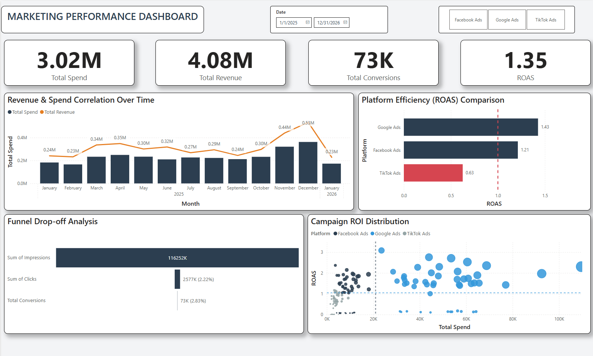
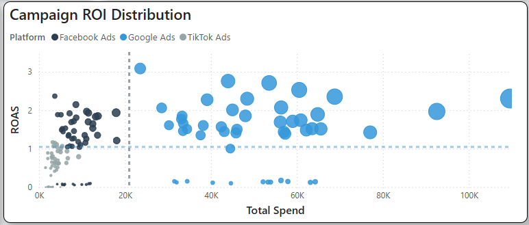

# 📊 Digital Marketing Performance Dashboard

## 1. Project Overview (Tổng quan)
This project analyzes marketing performance across three major platforms: **Facebook Ads, Google Ads, and TikTok Ads**. The goal is to solve the problem of fragmented data and identify budget allocation inefficiencies.

* **Role:** Data Analyst / BI Developer
* **Status:** Completed

## 2. Key Features (Tính năng chính)
* **Multi-channel Analysis:** Consolidated data from 3 platforms into a unified view.
* **Automated Data Cleaning:** Python script to simulate and process raw data.
* **Advanced DAX Measures:** Calculated ROAS, MoM Growth, and CPA.
* **Strategic Insights:**
    * Identified **TikTok Ads** as the lowest performing channel (ROAS < 1).
    * Visualized **Conversion Funnel** to pinpoint drop-off stages.
    * **Quadrant Analysis** (Scatter Plot) to categorize campaigns by profitability.

## 3. Tech Stack (Công nghệ)
* **Data Generation:** Python (Pandas, Numpy) - *See `data/data_generator.py`*
* **Visualization:** Microsoft Power BI
* **Data Modeling:** Star Schema (Fact & Dimension tables)

## 4. Dashboard Screenshots (Hình ảnh)

### Overall Dashboard

*An interactive view of KPIs, Trends, and Platform Breakdown.*

### Campaign Strategy Matrix (Scatter Plot)

*Analyzing Spend vs. ROAS to identify "Cash Cows" and "Bleeding" campaigns.*

## 5. How to Run (Cách chạy dự án)
1.  Clone this repository.
2.  Run `data/data_generator.py` to generate the dataset.
3.  Open `dashboard/Marketing_Dashboard.pbix` in Power BI Desktop.
